# ChemDraw Energy Diagram Plotter
[](https://zenodo.org/badge/latestdoi/475440667)

This is a tool that can create pixel-accurate energy diagrams as ChemDraw objects. After opening the generated ChemDraw file, you can add chemical structures, adjust tags, and do whatever else that ChemDraw can do.

[中文版使用说明（旧版）](http://bbs.keinsci.com/thread-9256-1-1.html)

## Launch

If you're using Windows 10/11 and you don't have a Python environment, you can find an executable version (packed by pyinstaller on Windows 10) in [the release](https://github.com/liyuanhe211/Energy_Diagram_Plotter_CDXML/releases/tag/3.4.1). Once you've downloaded it, go to the folder and run `Energy Diagram Plotter CDXML X.X.X.exe`.

Alternatively, if you have a python environment on Windows or Linux, you can build a virtual environment with pipenv by using the provided pipfile:
```
pip install pipenv
mkdir .venv
pipenv sync
pipenv run python Draw_Energy_Diagram_XML.py
```

## Introduction
To draw energy diagrams in the literature, lots of people do that by hand-drag the lines in ChemDraw and eyeball the position. But this can be extremely inaccurate and even lead to misleading results. As an example, the left figure in the image below was clearly drawn manually in ChemDraw, while the right is the to-scale version (ignore the unit change from kcal/mol to kJ/mol). The original diagram is a mess and even worse than just giving numbers as a table. There are other tools available that can generate energy diagrams, such as DataGraph, mechaSVG, and Origin, but they usually generate an un-editable figure with very limited customization options. Additionally, you cannot drag the numbers and tags, which can be troublesome for complex energy diagrams.

<p align="center">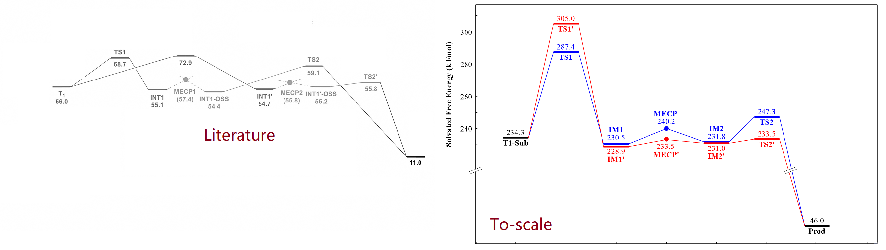</img></p>

This program genreates pixel-accurate energy diagrams as ChemDraw objects.

## Input file
Below is the input file format, and there are also [several other examples](https://github.com/liyuanhe211/Energy_Diagram_Plotter_CDXML/tree/main/Examples) available in this repository:

<p align="center">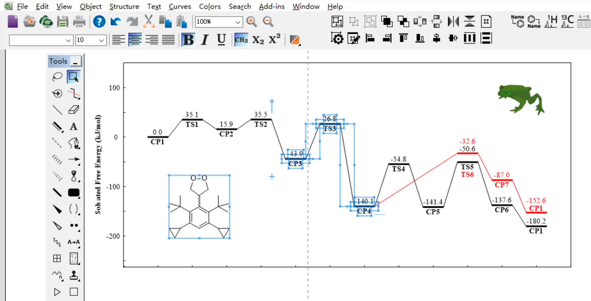</img></p>

<p align="center">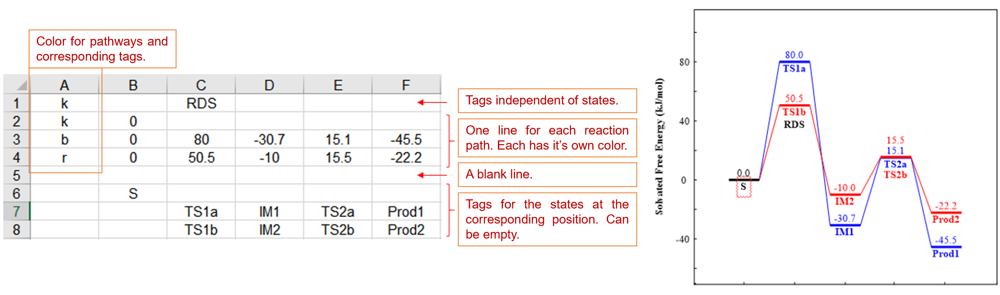</img></p>

The color for each reaction path is specified at the first column. You can specify any color with its RGB value "#XXXXXX". Some colors have shortcuts, and the "tabcolors" can be specified by **B**, **O**, **G**, **R**, **P**, **BR**, **PI**, **GR**, **OL**, **C** (all uppercase). See [this](Examples/4%20TabColors.xlsx) example input file:

<p align="center">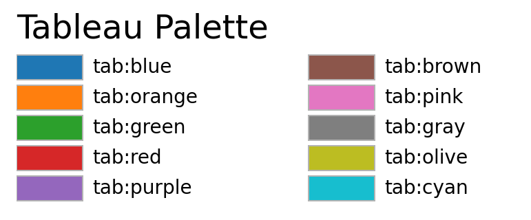</img></p>

<p align="center">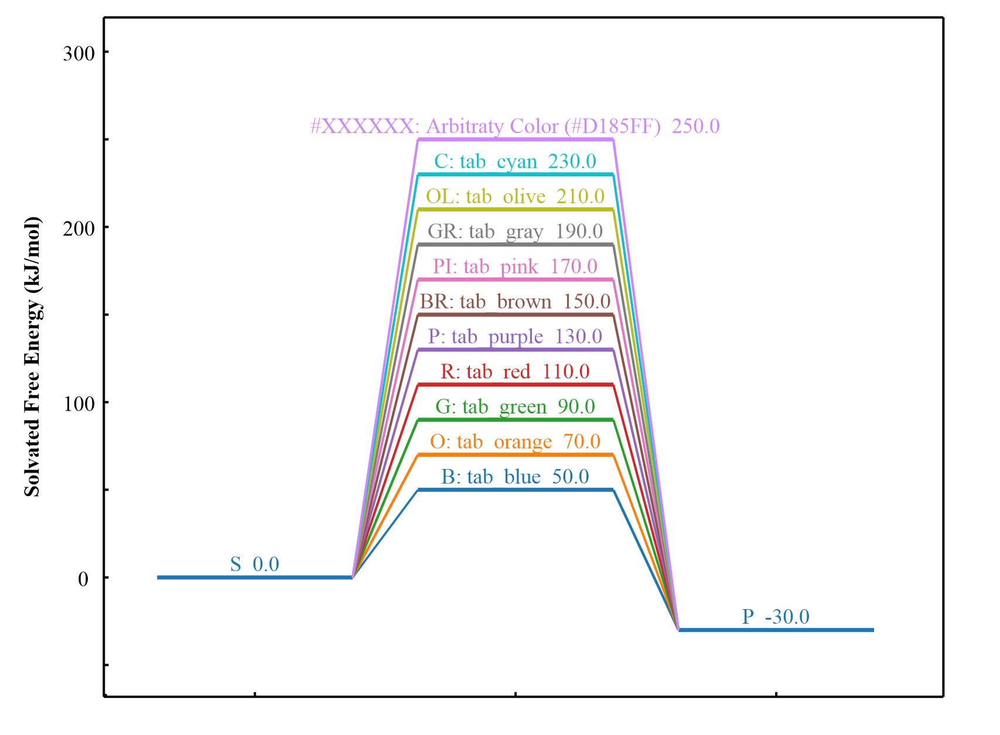</img></p>

There are also some predefined "pure colors" that can be used with the shorthand codes **y**, **m**, **c**, **r**, **g**, and **b** (top to bottom).

<p align="center">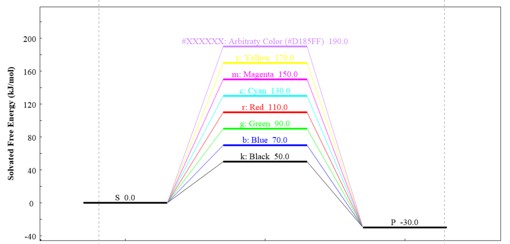</img></p>

## Settings
The tool also provides several options to customize the energy diagram. The options in the GUI are explained in the following figures (You can also hover on the options to see a tooltip):

<p align="center">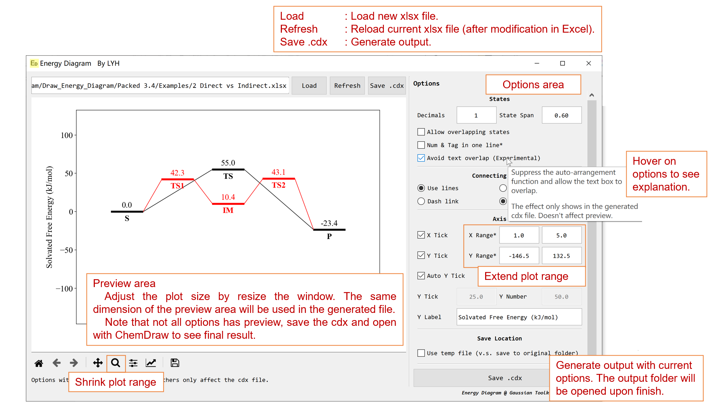</img></p>

(The font of the figure is fixed to Arial (you can change it later in ChemDraw), and the canvas size and aspect ratio of the figure are determined by the window size.)

Here are some visuals for each option. Note that some of the following options are only reflected in the ChemDraw file, not in the preview view:

`Decimals` and `State span`:
<p align="center"><kbd>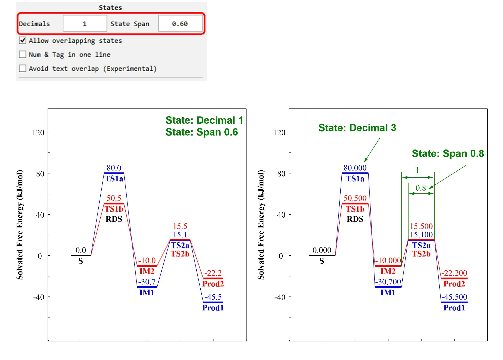</img></kbd></p>

`Allow overlapping states` and `Avoid text overlap`:
<p align="center"><kbd>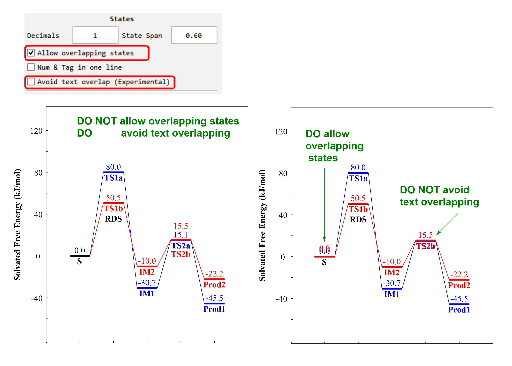</img></kbd></p>

`Num & Tag in one line`:
<p align="center"><kbd>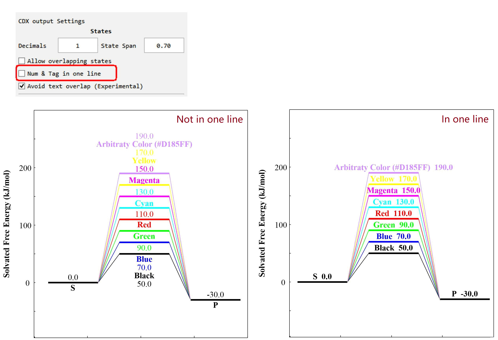</img></kbd></p>

Properties for `Links`:
<p align="center"><kbd>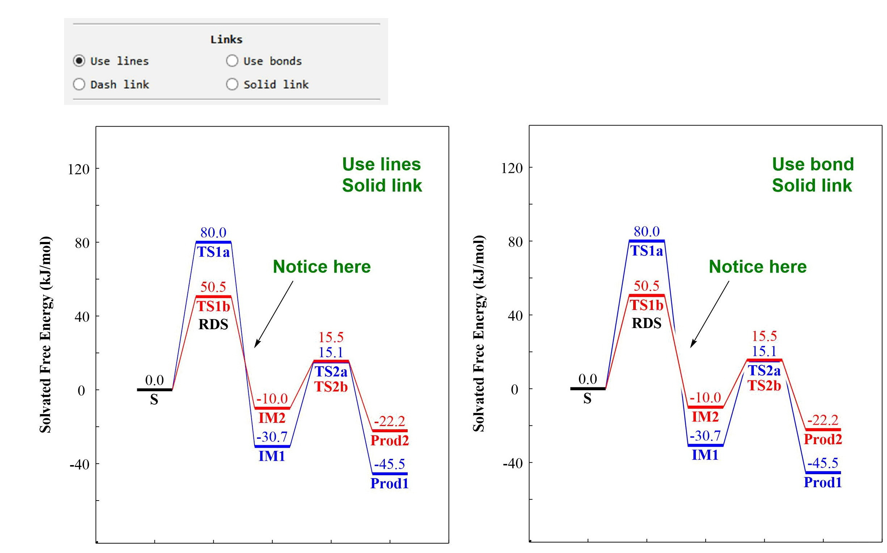</img></kbd></p>

<p align="center"><kbd>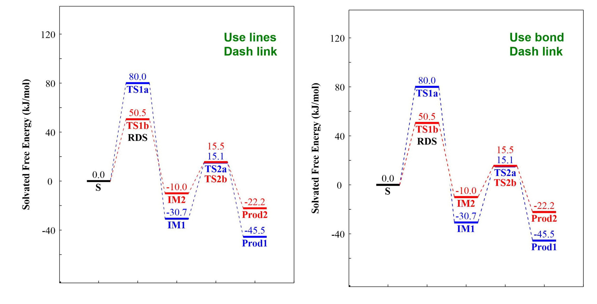</img></kbd></p>

The option "Use Temporary File" allows you to choose whether the program creates a file in its own Temp folder (which you need to Save As to another place after viewing) or directly generates a CDX file in the directory where Excel is located.

Other options that's not mentioned above should be self-explanatory.

## Known issues
 * The program stores its temporary files in the program directory, so it requires read/write permissions to this directory. It's not recommended to install the program in a path with permission restrictions, such as Program Files. If you do so, please grant the program administrator permissions.

 * The preview interface is not entirely accurate. If you experience any unexpected behavior, export the ChemDraw file first to check if it's normal.

 * Changes to the format (title, label, ticks, etc.) through the Matplotlib toolbar will not be carried over to the exported CDXML file (except for adjustments to the plot region). Please make those adjustments in ChemDraw.

 * The "Avoid Text Overlap" function uses a greedy algorithm and may produce unreasonable results in particularly crowded situations. You can fine-tune it yourself by holding down Shift and dragging the text in ChemDraw to ensure it moves horizontally or vertically.

<p align="center"><kbd>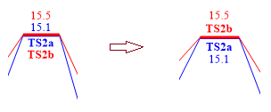</img></kbd></p>

 * I wrote this quite a few years ago, so the codes are a little messy. A cleanup is due.


## For bug report

If you encounter any unexpected behavior, please try running the [examples](https://github.com/liyuanhe211/Energy_Diagram_Plotter_CDXML/tree/main/Examples) first to determine whether the problem is with your input or the program.

If the issue is with the program, please provide feedback by uploading your Excel input file, a screenshot of the GUI before the crash, and the last display in the CMD window. If the output file is generated, but there is a problem with it, please upload the output file as well.

To keep the error message before the program exits, please run it using the "Draw_Energy_Diagram_XML.bat" file in the directory.

## Citation

Citing this program is optional. If you choose to cite this, you can use the Zenodo DOI: `10.5281/zenodo.7187658`. 

E.g. Li, Y.-H. _Energy Diagram Plotter CDXML 3.5.1_ (DOI: 10.5281/zenodo.7187658), **2022**.

## Change log

### 3.5.3

 * Bug fix: Specify UTF-8 encoding for non-ASCII character